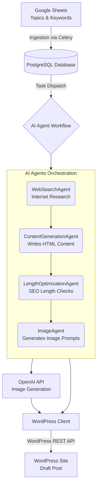

# SEO Blog Agent - High-Level Architecture

This document provides a straightforward overview of how the SEO Blog Agent system creates and publishes a blog post from start to finish.

## System Diagram

## 1. Ingestion (Getting the Data)
The system uses scheduled tasks (via Celery) to regularly check **Google Sheets** for new blog topics, keywords, and instructions. When it finds new entries, it saves them as tasks in our **PostgreSQL database** and adds them to a queue to be processed automatically.

## 2. The Agents Run (Creating the Content)
Once a task is picked up from the queue, a team of specialized AI agents works step-by-step to build the blog post:
* **WebSearchAgent**: Browses the web to collect the latest facts, news, and statistics about the topic.
* **ContentGenerationAgent**: Writes the actual SEO-friendly blog post in HTML format using the research data and requested keywords.
* **LengthOptimizationAgent**: Checks and fixes the title and meta description to ensure their lengths perfectly match SEO rules.
* **ImageAgent**: Writes detailed instructions (prompts) and metadata for the images that will be included in the post.

## 3. Image Generation
The system takes the prompt instructions created by the ImageAgent and connects to an **AI Image Generation API** (like OpenAI) to create the actual picture files for the article.

## 4. Publishing to WordPress
Finally, the system pieces everything together. The **WordPress Client** securely connects to the site via the **WordPress REST API**. It uploads the generated images to the media library, embeds them into the HTML article, and saves the final blog post as a "Draft" ready for review.
