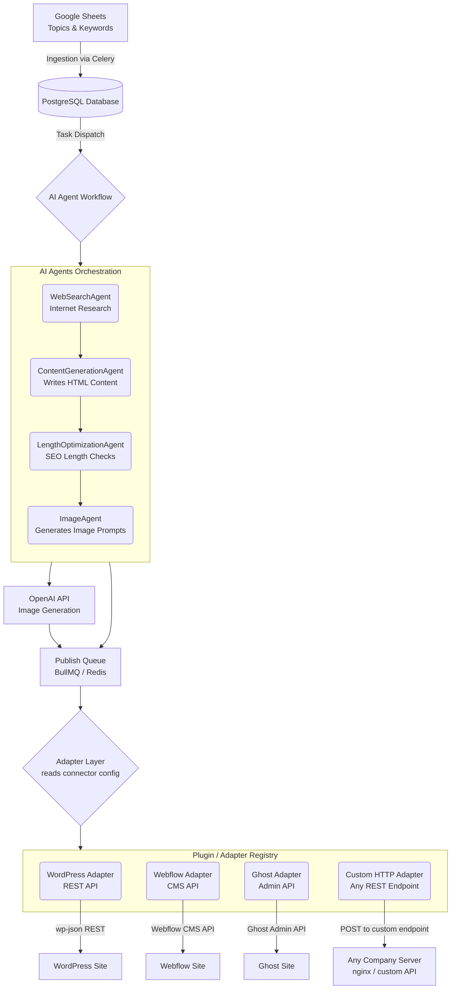

# SEO Blog Agent - Simple High-Level Architecture

This document provides a straightforward, easy-to-understand overview of how the SEO Blog Agent system creates and publishes a blog post from start to finish — including how it can publish to **any company's website**, not just WordPress.

## System Diagram



---

## 1. Ingestion (Getting the Data)
The system uses scheduled tasks (via **Celery**) to regularly check **Google Sheets** for new blog topics, keywords, and instructions. When it finds new entries, it saves them as tasks in our **PostgreSQL database** and adds them to a queue to be processed automatically.

---

## 2. The Agents Run (Creating the Content)
Once a task is picked up from the queue, a team of specialized AI agents works step-by-step to build the blog post:

- **WebSearchAgent** — Browses the web to collect the latest facts, news, and statistics about the topic.
- **ContentGenerationAgent** — Writes the actual SEO-friendly blog post in HTML format using the research data and requested keywords.
- **LengthOptimizationAgent** — Checks and fixes the title and meta description to ensure their lengths perfectly match SEO rules.
- **ImageAgent** — Writes detailed prompts and metadata for the images that will be included in the post.

---

## 3. Image Generation
The system takes the prompt instructions created by the ImageAgent and connects to an **AI Image Generation API** (like OpenAI) to create the actual picture files for the article.

---

## 4. Publish Queue
Before publishing, the fully assembled post (HTML content + images) is placed onto a **Publish Queue** (backed by BullMQ / Redis). This decouples content generation from delivery and provides:

- **Retry logic** — if the target CMS is temporarily down, the post is retried automatically.
- **Failure alerts** — failed publishes are logged and flagged for review.
- **Rate limiting** — prevents hammering a company's API with too many requests at once.

---

## 5. Adapter Layer — Publishing to Any Website

This is the key architectural pattern that makes the system work across **any company's website**, not just WordPress.

Each customer registers a **Connector Config** — a small JSON object that tells the system *how* to publish to their specific site. No custom code is needed per customer.

### How it works

The **Adapter Layer** reads the connector config and routes the post to the correct adapter:

```
Publish Queue  →  Adapter Layer (reads config)  →  Correct Adapter  →  Company's CMS / API
```

---

### What the Customer Must Provide

To connect their website, each customer supplies **4 things**:

#### 1. Connector Type
Which platform their site runs on. This tells the system which adapter to use.

```
"connector_type": "wordpress"    ← for WordPress sites
"connector_type": "webflow"      ← for Webflow sites
"connector_type": "ghost"        ← for Ghost sites
"connector_type": "custom_http"  ← for any custom / in-house API
```

#### 2. Endpoint URL
The URL on their server where the blog post should be sent.

```
"endpoint": "https://theirsite.com/wp-json/wp/v2/posts"  ← WordPress example
"endpoint": "https://theirsite.com/api/blogs"             ← Custom API example
```

For **WordPress / Webflow / Ghost**, this URL follows a known pattern — we can auto-fill it once we know their domain.
For **custom sites**, the customer provides the exact POST endpoint their backend exposes.

#### 3. Auth Credentials
How to prove we are allowed to publish on their behalf. Three supported methods:

| Auth Type | When to use | What customer provides |
|---|---|---|
| `basic` | WordPress (older setup) | Username + Application Password |
| `bearer` | Most modern APIs | A secret token / API key |
| `api_key` | Webflow, Ghost, custom | A key generated from their CMS dashboard |

```json
// Bearer Token example
"auth": { "type": "bearer", "token": "sk_live_xxxxxxxxxxxx" }

// Basic Auth example
"auth": { "type": "basic", "username": "admin", "app_password": "xxxx xxxx xxxx" }
```

> Credentials are stored encrypted. They are never logged or exposed in publish queue payloads.

#### 4. Field Map
Our system produces a standard blog object with fixed field names. The customer's API may use different field names. The field map bridges the two.

Our standard output fields:

| Our Field | What it contains |
|---|---|
| `title` | The blog post headline |
| `body` | Full HTML content of the article |
| `slug` | URL-friendly version of the title |
| `excerpt` | Short summary / meta description |
| `featured_image_url` | URL of the generated hero image |
| `tags` | Array of topic tags |
| `status` | `draft` or `publish` |

Customer maps these to whatever their API expects:

```json
"field_map": {
  "title":              "blog_title",
  "body":               "html_content",
  "slug":               "url_path",
  "excerpt":            "meta_description",
  "featured_image_url": "hero_image",
  "tags":               "categories",
  "status":             "publish_state"
}
```

For **WordPress / Webflow / Ghost** — the field map is pre-configured. The customer does not need to fill this manually.
For **custom sites** — the customer fills this once during onboarding, matching our fields to their API's expected keys.

---

### Example Connector Configs

**WordPress** *(field map pre-filled — customer provides domain + credentials only)*
```json
{
  "connector_type": "wordpress",
  "endpoint": "https://theirdomain.com/wp-json/wp/v2/posts",
  "auth": { "type": "basic", "username": "api_user", "app_password": "xxxx xxxx" },
  "field_map": { "title": "title", "body": "content", "excerpt": "excerpt", "status": "publish" }
}
```

**Custom HTTP** *(nginx / any in-house REST API — customer fills all four fields)*
```json
{
  "connector_type": "custom_http",
  "endpoint": "https://company.com/api/blogs",
  "method": "POST",
  "auth": { "type": "bearer", "token": "their_secret_token" },
  "field_map": { "title": "blog_title", "body": "html_content", "slug": "url_slug" }
}
```

---

### Built-in Adapters

| Adapter | Target Platform | Auth Method | Field Map |
|---|---|---|---|
| `wordpress` | WordPress REST API | Basic / App Password | Pre-configured |
| `webflow` | Webflow CMS API | Bearer Token | Pre-configured |
| `ghost` | Ghost Admin API | API Key | Pre-configured |
| `custom_http` | Any REST endpoint | Bearer / Basic / API Key | Customer fills once |

> **The `custom_http` adapter covers any company** that exposes even a basic POST endpoint — no new adapter code needs to be written.

---

## End-to-End Summary

| Step | Component | What Happens |
|---|---|---|
| 1 | Google Sheets + Celery | New topics are ingested into the DB queue |
| 2 | AI Agents | Research → Write → SEO check → Image prompts |
| 3 | OpenAI API | Images are generated |
| 4 | Publish Queue | Post is queued with retry & failure handling |
| 5 | Adapter Layer | Connector config is read; correct adapter selected |
| 6 | Adapter → CMS | Post is published to WordPress / Webflow / Custom site |
